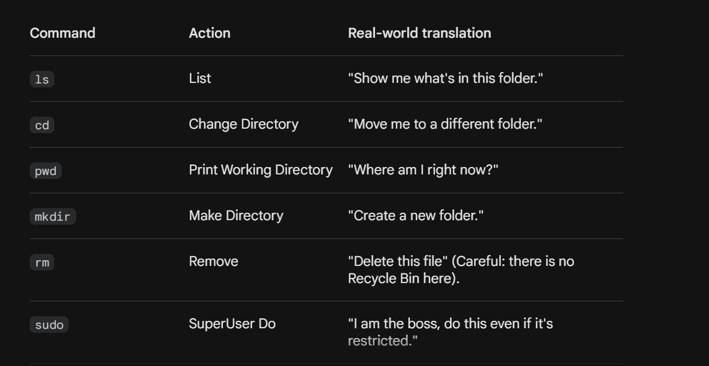
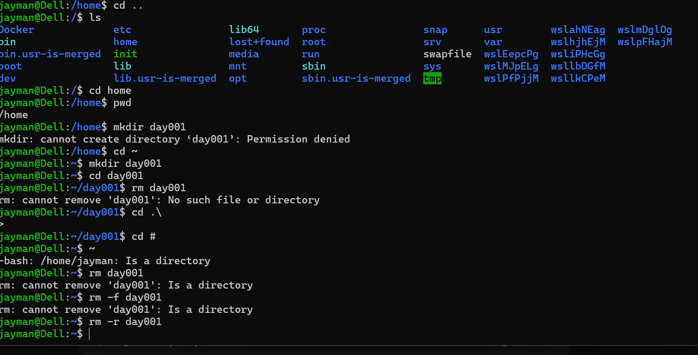

# Day 01 - [Topic]

## Objective

What was the goal for today?

To learn the  basic of Linux and his component.

## What I Learned

- Learnt how Linux have lineage back to unix operating system, and some example of linux like debian, Ubuntu, and i also end instaliing the application on my system. 
- Also learnt the different between Shell, Bash and Terminal. The Terminal also known as command line is the the interface that make you interact with the computer, the shell interprete and execute your command while Bash is a popular example of shell. 
- Also learned the basic of linux command like ls to list all folder all the things in a folder, cd to move to particular folder, mkdir to create a folder. 

---

## What I Built / Practiced

- I created a folder with mkdir. also was able to move into the folder with cd and also list the folder context.
- Try to deleted the folder with rm, and then realised that rm is only used for files, that i must add -r on a folder.

---

## Challenges Faced

- I faced some little challenges why i was trying to created a folder in /home, which was solved by a google search, i was also to learnt that is not alllowed to created a folder except i used sudo command to force the computer to do what i want.
- 

---

## Key Takeaways

- Today learning make me realised that i have been using some linux command before today on my window computer such as cd, mkdir and ls in the command prompt and unlike window linux does not have recycle bin, so once i deleted anything is gone forever, so no room for mistake.
- 

---

## Resources
https://github.com/Najeeb-Sulaiman/linux-and-bash-scripting-guide
- 

---

## Output

(Include links, screenshots, code snippets, or results)
