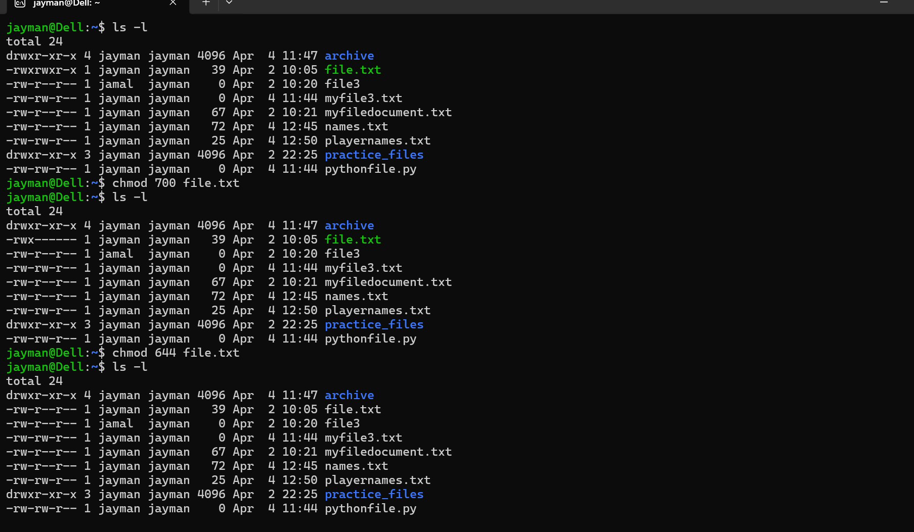

# Day 05 - [Topic]

## Objective

What was the goal for today?

To learn more about chmod and chown 

## What I Learned

- I learnt how group really works, from changing ownership, creating a group, adding a user to a group.  
- I also learnt that having access to a folder to read/write/execute by group, does mean you can create file or folder in folder created by another user in the parent folder that you have access to, until the person give the group permission to write.  
- I also learnt the concept of SDIG, as the act you enforce that every file created in a folder that a group have access to, to automatically inherit the group, instead of the user that created it only.

---

## What I Built / Practiced

- I try adding user to different group, giving permission to user through chmod and also used chmod +x to give access to a user to have privilege to execute a file
- I was able to solve a little execise that tested my understanding in file permission.

---

## Challenges Faced

- 
- 

---

## Key Takeaways

- How group can make work easily as mulitple user can have access to a folder, and they can easily edit, write and execute without the apporval of other users.
- How a single folder can have different group with different privilege, for example a data analyst group can only read and execute while data engineering group can write, read and execute the same folder

---

## Resources
https://github.com/Najeeb-Sulaiman/linux-and-bash-scripting-guide

---

## Output

(Include links, screenshots, code snippets, or results)
