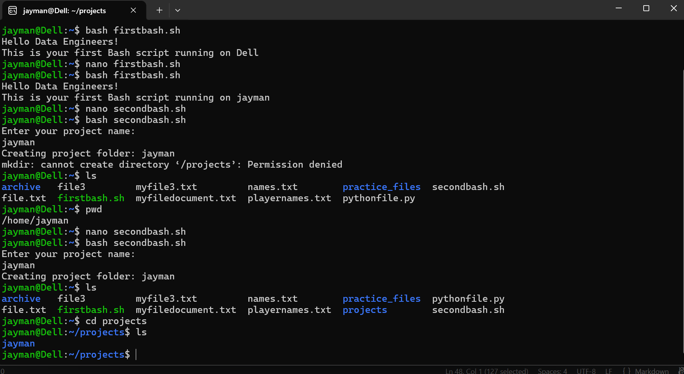

# Day 06 - [Topic]

## Objective

What was the goal for today?
Start learning about Bash.
---

## What I Learned

- Learn what bash is all about, how is make work easier and things is can be use for like automation.
- learn the basic rules of using bash, like #!/bin/bash must start your the script file in order to tell the computer to use bash as the shell. 
- echo to print the terminal,line starting with  # are comments 
- Learnt how variable works, using read to accept user input, and also some in built variable like $USER, $PWD, $HOSTNAME and so on
- how to use export to make any program have acesss to make it save in a a variable  and readonly to make a variable constant during execution.

---

## What I Built / Practiced

- I ran my first shell script.
- 

---

## Challenges Faced

- 
- 

---

## Key Takeaways

- It very important to know bash, because without it you will end up repeating some task you supposed to automate.
- using read to ask for user input.

---

## Resources

https://github.com/Najeeb-Sulaiman/linux-and-bash-scripting-guide
 

---

## Output

(Include links, screenshots, code snippets, or results)
