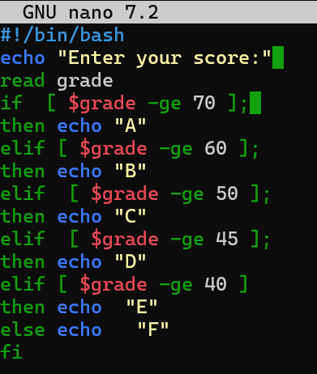
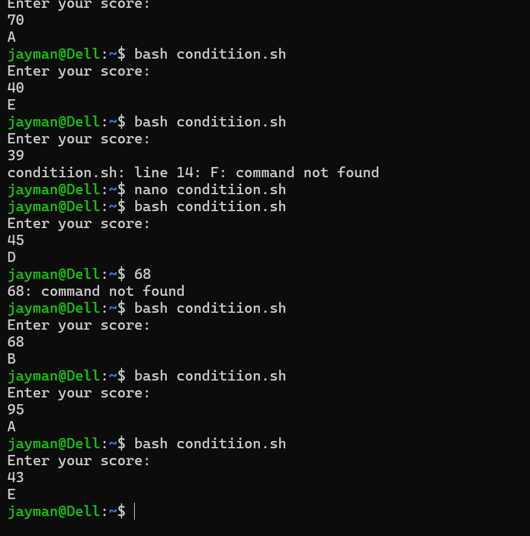
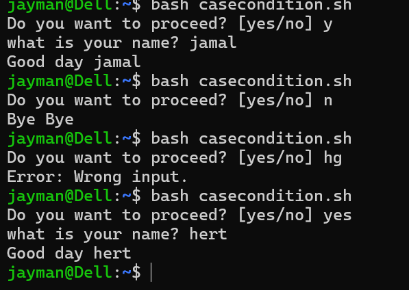
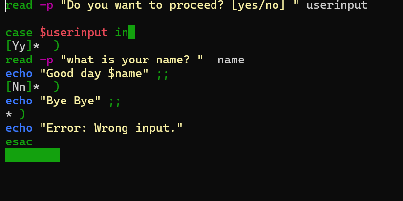

# Day 07 - [Topic]

## Objective

What was the goal for today?

Today to learn about condition(if and case)

## What I Learned

- Today I have how learned to properly used if and case condition.
- I also learned about -p(prompt), that can be use in front of read to ask for the user input instead of using echo
- I also learned that case does not work directly with case, it better i used if/elif/else

---

## What I Built / Practiced

- I built a simple script that will ask user for score and return the person grade
- Also built another one that will ask if the user want to proceed, if yes, it will ask for the user name and great and if no, it will great the user bye bye. 

---

## Challenges Faced

- 
- 

---

## Key Takeaways

- In your if condition [ they should space before and after your code ]
- how -f, -gt, -d, -ge and so on works.

---

## Resources

- https://github.com/Najeeb-Sulaiman/linux-and-bash-scripting-guide

---

## Output

(Include links, screenshots, code snippets, or results)
