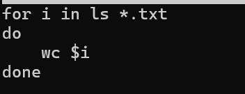
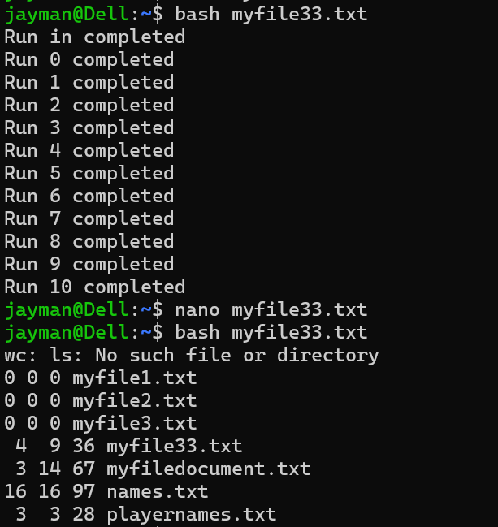

# Day 08 - [Topic]

## Objective

What was the goal for today?

To Learned For loop and while

## What I Learned

- Learned how for loop work and while loop.
- learned how to use range in bash(using seq, {1..10})
- learned how break, continue and nested loop works 

---

## What I Built / Practiced

- using loop, wc and ls command to print all the word count, line and character of all .txt file in my working directory. 
- 

---

## Challenges Faced

- 
- 

---

## Key Takeaways

- 
- 

---

## Resources

- https://github.com/Najeeb-Sulaiman/linux-and-bash-scripting-guide

---

## Output

(Include links, screenshots, code snippets, or results)
