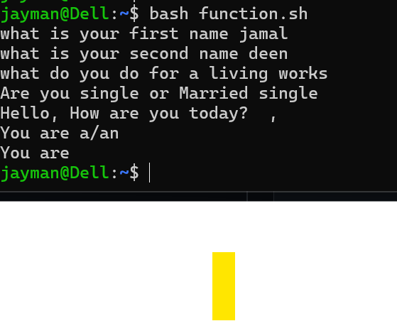
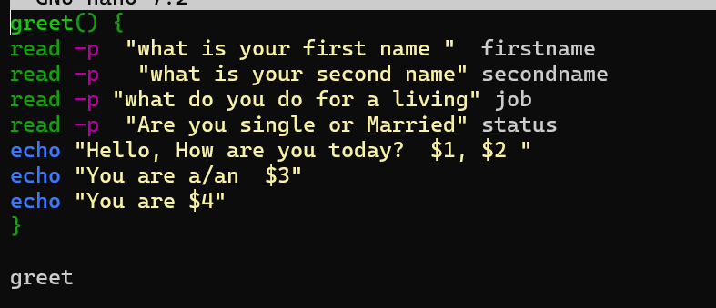

# Day 10 - [Topic]

## Objective

What was the goal for today?

To learn what function is all about

## What I Learned

- I learned what function is all about.
- I also learned how you can import another function for my file to another
- Learnt how awk, sed works

---

## What I Built / Practiced

- Built a simple script to accepted user input with a function
- 

---

## Challenges Faced

- using $1 that was meant to access function input, for userinput   
- 

---

## Key Takeaways

- 
- 

---

## Resources

- https://github.com/Najeeb-Sulaiman/linux-and-bash-scripting-guide

---

## Output

(Include links, screenshots, code snippets, or results)
